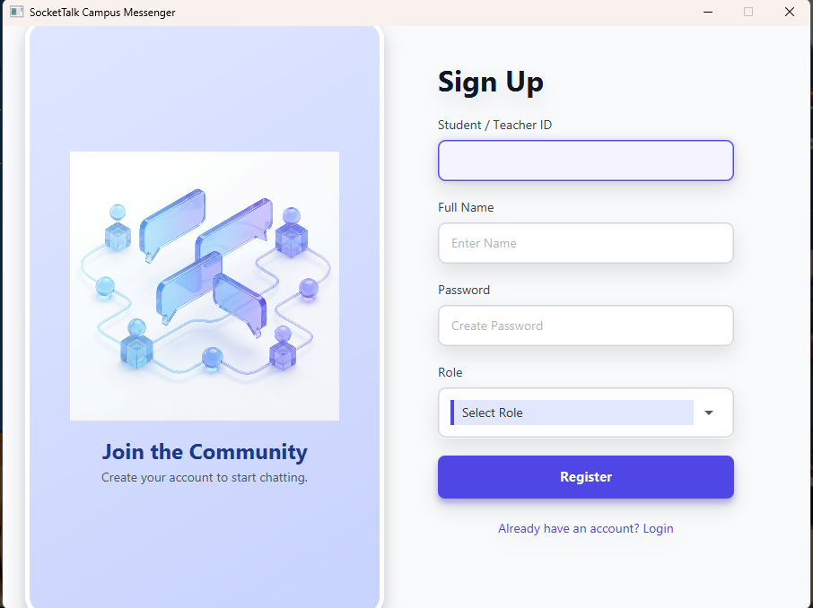
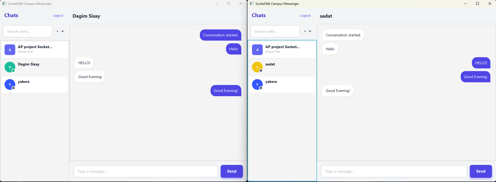
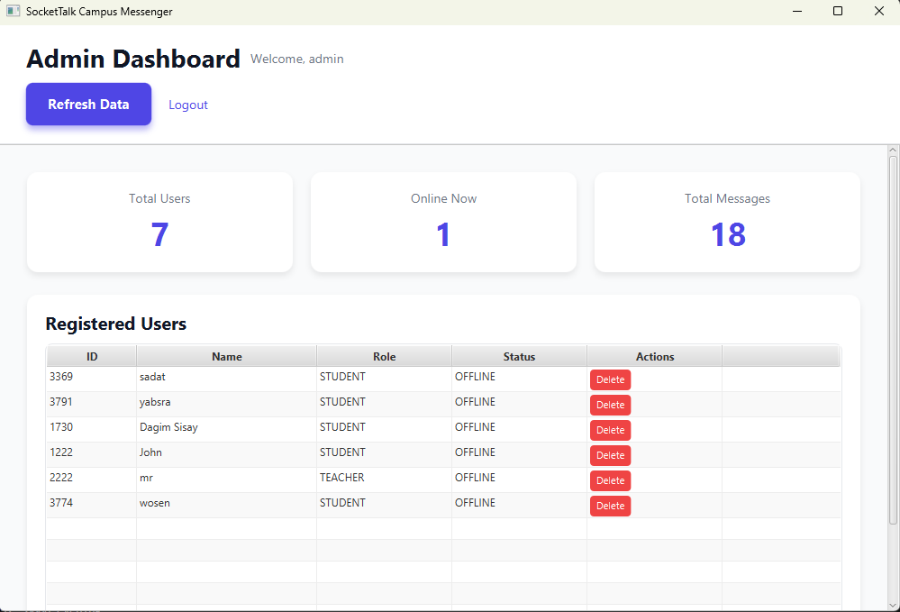

# SocketTalk Campus Messenger
A real-time desktop chat app built in Java where students can message each other, see who's online, and admins can manage accounts.

## Features
- Real-time private messaging over TCP sockets
- User login and registration
- Online/offline status indicators
- Chat history that saves and loads between sessions
- Admin panel for managing users and viewing stats
- Auto-generated colour avatars per user

## Technologies Used
- Java
- JavaFX (UI)
- CSS
- TCP Sockets

## The Process
- The server listens for connections and spins up a new thread for each user that joins. A shared map keeps track of who's online so messages can be routed to the right person instantly.
- Messages between the client and server are just plain strings separated by a `|` character, something like `MSG_PRIVATE|bob|Hey!`. The server splits that string and figures out what to do based on the first part.
- User accounts are saved in a simple text file. Chat history is saved per conversation in its own file, with a naming convention that stays consistent no matter who sends first.
- On the client side, a background thread handles all incoming messages so the UI never freezes. Any time the UI needs to update from that thread, it gets handed off safely to the JavaFX thread.
- User avatars are coloured based on the user's ID, so everyone always gets a different colour without needing to store it anywhere.


## How to Run

### Prerequisites
- **JDK 17+** — Download from [adoptium.net](https://adoptium.net) (pick the latest LTS). Make sure `java` and `javac` work in your terminal after installing.
- **JavaFX SDK** — Since Java 11, JavaFX no longer comes bundled with Java. Download the SDK for your OS from [gluonhq.com/products/javafx](https://gluonhq.com/products/javafx). Extract it somewhere easy to find (e.g. `C:\javafx-sdk` or `~/javafx-sdk`).

> **Easiest alternative:** Use an IDE like **IntelliJ IDEA** — it can handle the JavaFX setup for you with less manual work (see below).

---

### Option A — Running with an IDE

1. Clone or download the repo and open it as a project in **IntelliJ IDEA**.
2. Go to **File → Project Structure → Libraries**, click `+`, and add the `lib` folder from your JavaFX SDK download.
3. Go to **Run → Edit Configurations**, and in **VM options** add:
   ```
   --module-path /path/to/javafx-sdk/lib --add-modules javafx.controls,javafx.fxml
   ```
   Replace `/path/to/javafx-sdk` with wherever you extracted the JavaFX SDK.
4. Run the **server first** (`MainServer.java`), then run the **client** (`SocketTalkApp.java`).

---

### Option B — Running from the Terminal

**1. Compile the project**
```bash
javac --module-path /path/to/javafx-sdk/lib --add-modules javafx.controls,javafx.fxml -d out src/Server/*.java src/Clients/*.java src/UI/*.java
```

**2. Start the server**
```bash
java -cp out Server.MainServer
```

**3. Start the client** (in a separate terminal)
```bash
java --module-path /path/to/javafx-sdk/lib --add-modules javafx.controls,javafx.fxml -cp out UI.SocketTalkApp
```

> To test with multiple users, open additional terminals and run the client command again for each one.

---

### Notes
- The server must be running before any client connects.
- A `users.txt` file and `history/` folder will be created automatically in the project root on first run.
- By default the server runs on `localhost`. If you want clients on different machines to connect, update the server IP in the client config and make sure port `5555` is open on the host machine.

## Preview 




## What Was Learned
- How to manage multiple users connecting at the same time using synchronized methods and thread-safe data structures.
- Modularizing the network code and the UI code separate so they don't get tangled up, and safely passing data between background threads and the UI.
- Building a simple custom messaging protocol from scratch and the quirks that come with parsing it.
- Handling persistent storage with just plain files

## Future Plans
- Swap the text file storage for an actual database
- Message read receipts
